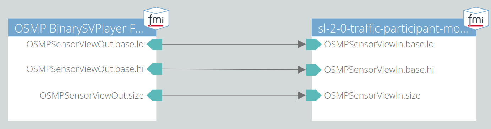

# 001 Smoke Test Tracefile

This test checks if the traffic participant model runs in an open-loop simulation without any runtime errors.

## System Structure Definition

The traffic participant model is connected with the input to the trace file player FMU.

## Scenario

The ego vehicle is placed on a straight road.
Since there is no FMU connected to the output, the model output is neglected.

## Pass/Fail Criterion

The test fails, if the model crashes during runtime.
