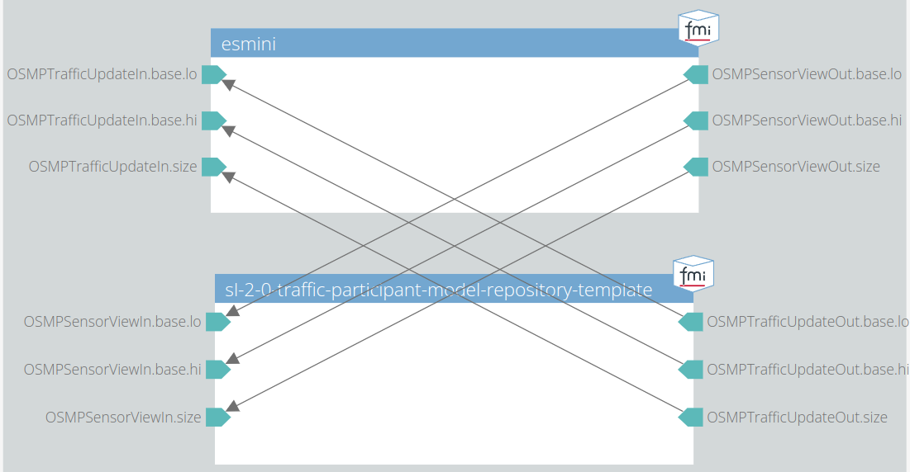

# 002 Integration Test Scenario

This test checks if the traffic participant model runs in a closed-loop simulation without any runtime errors.

## System Structure Definition

The traffic participant model is connected both with the SensorView input and the TrafficUpdate output to the esmini FMU, as shown in the following image.

## Scenario

The ego vehicle is placed on a straight road.
The movement of the ego vehicle is fully controlled by the traffic participant model.

## Pass/Fail Criterion

The test fails, if the model crashes during runtime.
