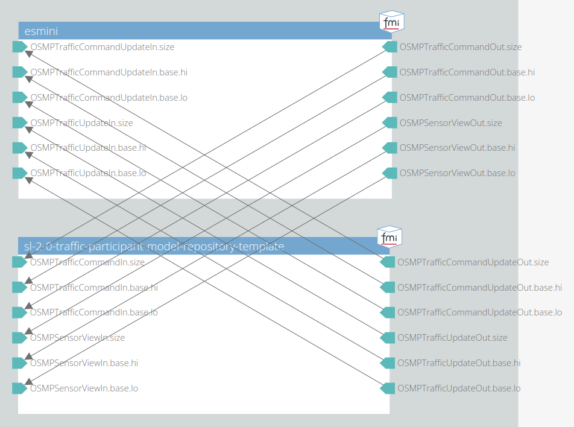

# 003 Integration Test Traffic Command

This test checks if the traffic participant model runs in a closed-loop simulation without any runtime errors, while receiving traffic commands at the input.

## System Structure Definition

The traffic participant model is connected to the esmini FMU, as shown in the following image.
It has an osi3::SensorView message as well as the optional osi3::TrafficCommand as input.
The traffic participant outputs both the osi3::TrafficUpdate and the optional osi3::TrafficCommandUpdate back to the esmini scenario player.

## Scenario

The ego vehicle is placed on a straight road.
The movement of the ego vehicle is defined by a speed action after 10 s in the scenario file.
However, the behavior of the ego vehicle is fully controlled by the traffic participant model.

## Pass/Fail Criterion

The test fails, if the model crashes during runtime.
