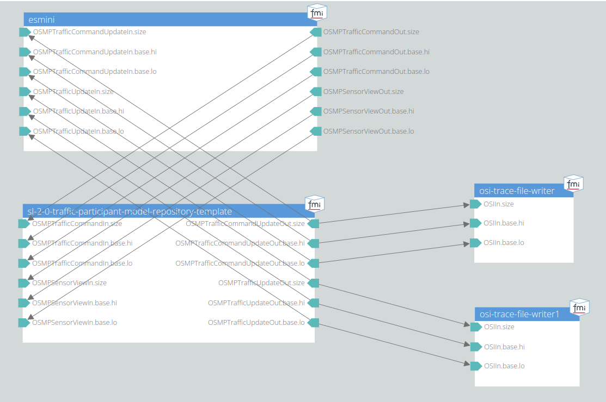

# 004 Integration Test Output Validation

This test uses the same scenario and similar setup as 003.
Additionally, the TrafficUpdate and TrafficCommandUpdate outputs of the model are written to trace files.

## System Structure Definition

The traffic participant model is connected to the esmini FMU, as shown in the following image.
It has an osi3::SensorView message as well as the optional osi3::TrafficCommand as input.
The traffic participant outputs both the osi3::TrafficUpdate and the optional osi3::TrafficCommandUpdate back to the esmini scenario player.
The traffic participant outputs are additionally connected to trace file writer FMUs.

## Scenario

The ego vehicle is placed on a straight road.
The movement of the ego vehicle is defined by a speed action after 10 s in the scenario file.
However, the behavior of the ego vehicle is fully controlled by the traffic participant model.

## Pass/Fail Criterion

The test fails, if the model crashes during runtime.
Additionally, all trace files are checked with osi-validation after the simulation.
